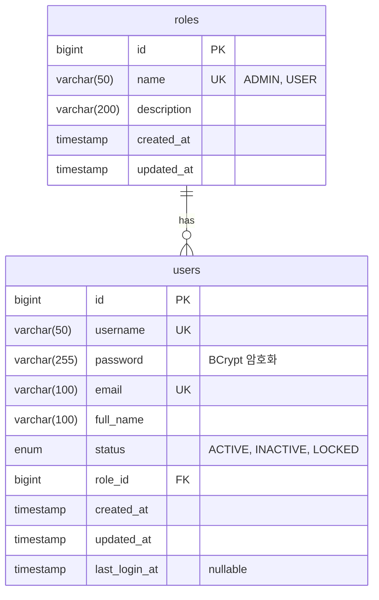

# 데이터베이스 ERD (Entity Relationship Diagram)

## 📊 테이블 관계도



## 🗃️ 테이블 상세 구조

### ROLES 테이블 (역할 관리)
| 컬럼명 | 데이터 타입 | 제약조건 | 설명 |
|--------|-------------|----------|------|
| id | BIGINT | PK, AUTO_INCREMENT | 역할 고유 ID |
| name | VARCHAR(50) | NOT NULL, UNIQUE | 역할명 (ADMIN/USER) |
| description | VARCHAR(200) | | 역할 설명 |
| created_at | TIMESTAMP | NOT NULL | 생성일시 |
| updated_at | TIMESTAMP | NOT NULL | 수정일시 |

### USERS 테이블 (사용자 관리)
| 컬럼명 | 데이터 타입 | 제약조건 | 설명 |
|--------|-------------|----------|------|
| id | BIGINT | PK, AUTO_INCREMENT | 사용자 고유 ID |
| username | VARCHAR(50) | NOT NULL, UNIQUE | 로그인용 사용자명 |
| password | VARCHAR(255) | NOT NULL | BCrypt 암호화된 비밀번호 |
| email | VARCHAR(100) | NOT NULL, UNIQUE | 이메일 주소 |
| full_name | VARCHAR(100) | NOT NULL | 사용자 실명 |
| status | ENUM | NOT NULL | 계정 상태 |
| role_id | BIGINT | NOT NULL, FK | 역할 참조키 |
| created_at | TIMESTAMP | NOT NULL | 생성일시 |
| updated_at | TIMESTAMP | NOT NULL | 수정일시 |
| last_login_at | TIMESTAMP | NULL | 마지막 로그인 일시 |

## 🔗 관계 설명

### 1:N 관계 (roles : users)
- **관계**: 하나의 역할(role)은 여러 사용자(user)를 가질 수 있음
- **외래키**: users.role_id → roles.id
- **제약조건**: CASCADE DELETE 없음 (데이터 무결성 보장)

## 📋 기본 데이터

### 기본 역할 데이터
```sql
INSERT INTO roles (name, description) VALUES 
('ADMIN', '시스템 관리자'),
('USER', '일반 사용자');
```

### 기본 사용자 계정
```sql
INSERT INTO users (username, password, email, full_name, status, role_id) VALUES 
('admin', 'admin123', 'admin@example.com', '관리자', 'ACTIVE', 1),
('test', 'test123', 'test@example.com', '테스트 사용자', 'ACTIVE', 2),
('km', 'km123', 'km@koreamarkers.com', 'KM 사용자', 'ACTIVE', 2);
```
*주의: 실제 운영 시에는 DataInitializer에서 BCrypt로 암호화됨*

## 🔍 인덱스 설계

### 성능 최적화용 인덱스
- `idx_username` : users.username (로그인 조회)
- `idx_email` : users.email (이메일 검증)
- `idx_role_name` : roles.name (역할 조회)

## 🔒 보안 고려사항

1. **패스워드 암호화**: BCrypt 알고리즘 사용
2. **개인정보 보호**: 이메일 등 민감정보 암호화 고려
3. **접근 제어**: role_id 기반 권한 분리
4. **감사 추적**: created_at, updated_at, last_login_at로 이력 관리

이 ERD는 Spring Boot + Spring Security 기반의 로그인 시스템을 위한 최소한의 구조로 설계되었습니다.